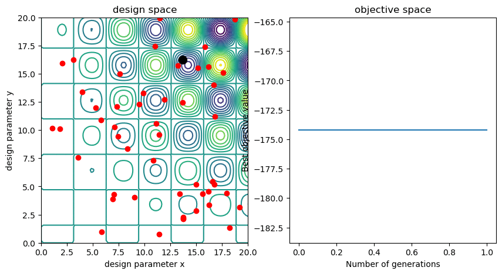

# simple_GA
A simple Python implementation of a single objective genetic algorithm with 2 design parameters (x and y). The objective is to minimise the function . The associated blog post can be found [here](https://www.datamachinist.com/evolutionary-optimisation/a-simple-genetic-algorithm/).



# Usage

```bash
python3 GA.py
```

